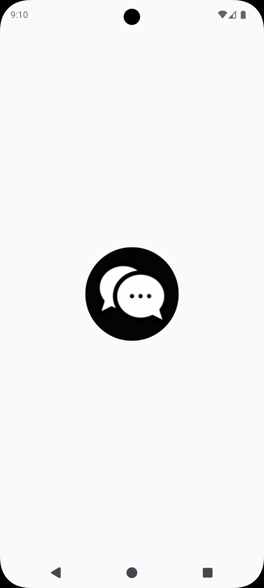
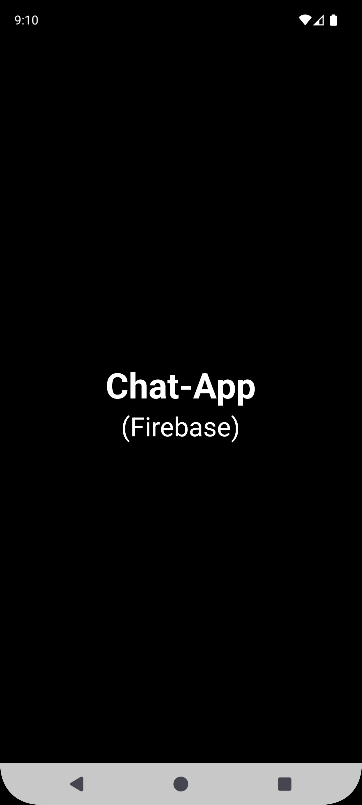
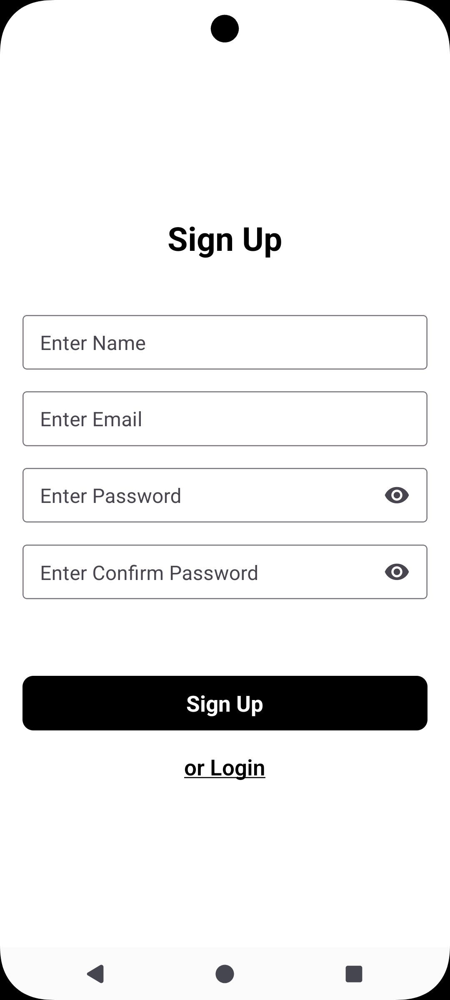
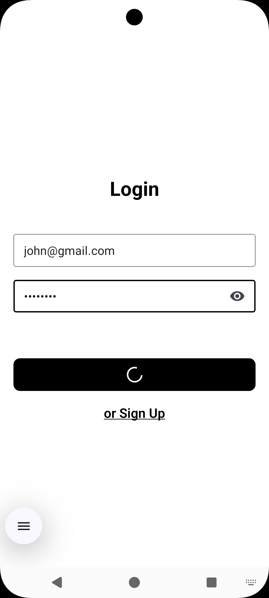
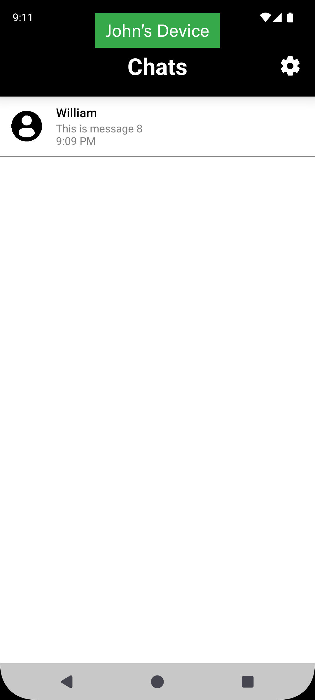
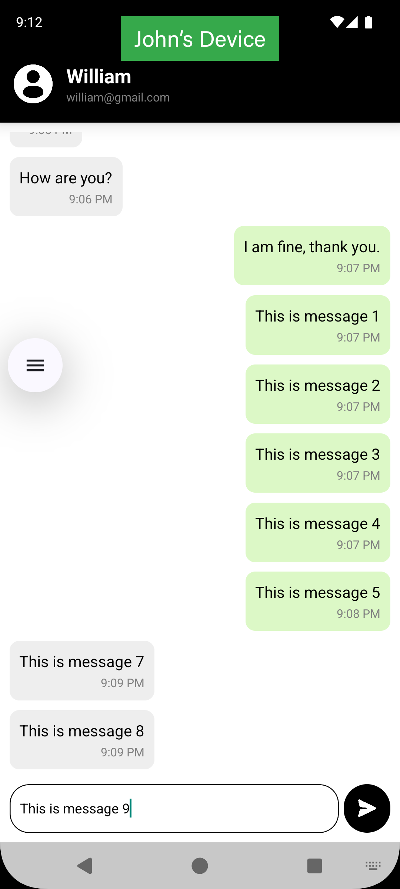
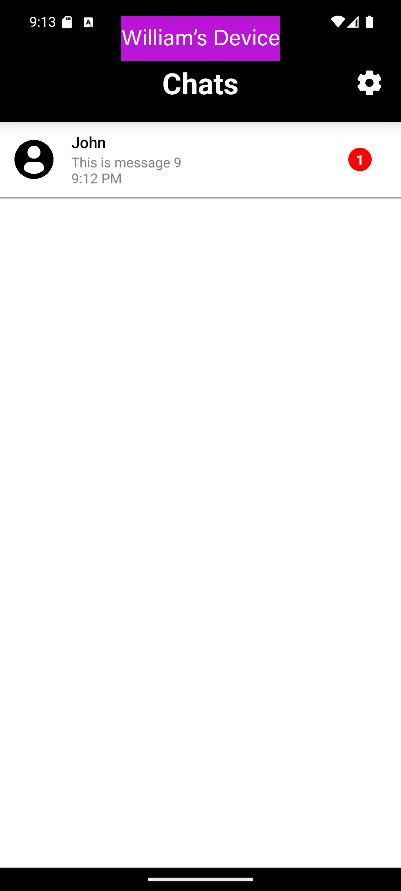
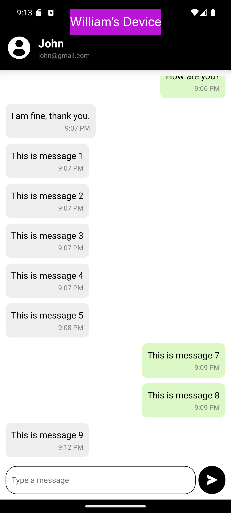
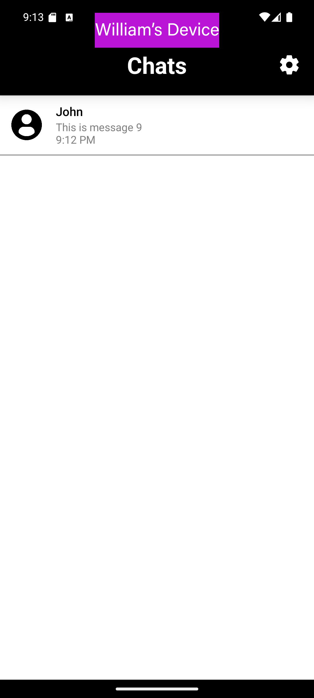
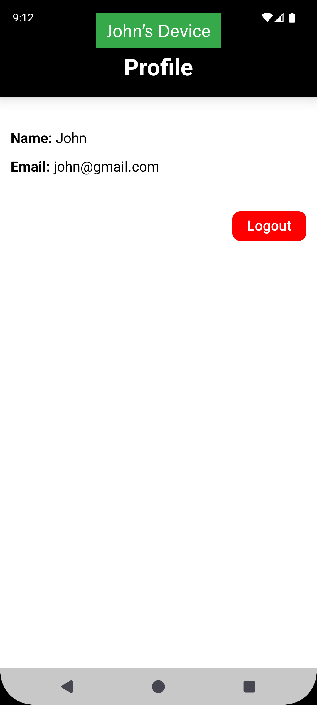

# Note: 
### Screenshots and demo-video of the project are included in the folder 'Screenshots_and_demo-video' of the repository.

# About This Project
This is a new [**React Native**](https://reactnative.dev) project, bootstrapped using [`@react-native-community/cli`](https://github.com/react-native-community/cli).

This project is an android application which allows users to chat (through text messages) in real-time. 

Following are the features of this application:
1) Create account (Login/SignUp) through 'Firebase Authentication'.
2) Sending/Receiving text-messages in real-time through 'Firebase Real-Time Database'.
3) Tracking the "seen" status of each of the messages (for both users of each chat) and rendering the number of unseen messages on a badge in the chat-list item. 
4) Sorting chats by timestamp, making the chats with the most recent messages appear at the top of the chat list.

In this project: 
1) The authorization is implemented using 'Firebase Authentication'.
2) Real-time chat is implemented suing 'Firebase Real-time database'.

### Tech Stack
1) React Native
2) Firebase Authentication (for user authentication)
3) Firebase Real-time Database (for real-time chat)

# How To Run This Project
## Step 1: Setup the enviromnet
Make sure you have completed the [Set Up Your Environment](https://reactnative.dev/docs/set-up-your-environment) guide before proceeding.

## Step 2: Setup Firebase
Setup 'firebase' files in the project, according to your google account. Such as including the 'goolge-services.json' file in the directory: "android/app/goolge-services.json".

## Step 3: Build and run your app
Make sure that the 'Android Studio' Emulator is running.
Navigate to the root directory of the project in 'command prompt' and run the following commands:

```sh
npm i
```

wait for packages to finish getting installed. Then run the command:

```sh
npm run android
```
The app will get installed in the 'Android Studio' Emulator and start running.

# Screenshots:












